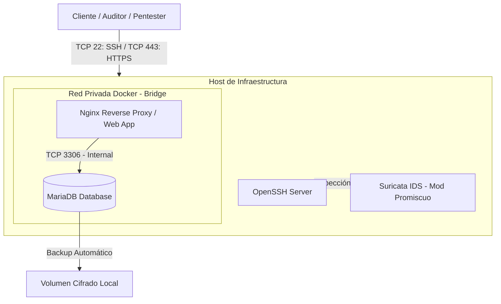

# OpsMatrix-Lab — Enterprise Telemetry & Infrastructure Hardening Platform

OpsMatrix-Lab es una arquitectura de referencia diseñada para desplegar, auditar y proteger un entorno SaaS transaccional sobre Ubuntu Server 24.04 LTS. El proyecto implementa un modelo de defensa en profundidad (Defense in Depth) combinado con telemetría pasiva de red (NIDS), emisión de PKI privada para cifrado TLS estricto y segmentación de microservicios en Docker.

## 1. Principios de Arquitectura & Gobierno (GRC)

* **Zero Trust & Least Privilege:** Aislamiento estricto de red. La base de datos opera en una subred interna no enrutable desde el host. Solo los puertos perimetrales necesarios (TCP 80, 443, 22) se exponen al exterior.
* **Defense in Depth:** Tres capas defensivas independientes:
  1. Perímetro HTTP/TLS: Terminación de cifrado y proxies inversos.
  2. Telemetría de Red: Inspección en modo promiscuo sobre la interfaz física del host.
  3. Aislamiento de Aplicación: Microservicios desacoplados en contenedores con volúmenes de almacenamiento dedicados.
* **Trazabilidad & Auditabilidad (No Repudio):** Centralización de evidencias con marcas de tiempo (timestamps) sincronizadas entre SSH (`auth.log`), Reverse Proxy (`access.log`), contenedores (`docker logs`) e IDS (`eve.json`).
* **Preparedness for Grey Box Assessment:** La infraestructura está diseñada con un alto nivel de observabilidad para correlacionar eventos de administración legítima frente a escenarios de auditoría ofensiva / pentesting.

## 2. Topología de Red y Arquitectura por Capas

El sistema se estructura en tres dominios operativos principales:

```text
                     CLIENTE / AUDITOR / PENTESTER
                                   │
                                   ▼
                       Ubuntu Server Host (24.04)
                                   │
       ┌───────────────────────────┼───────────────────────────┐
       │                           │                           │
    OpenSSH                    Suricata                     Docker
 (Admin TCP :22)             (NIDS Host)                       │
                                              ┌────────────────┴────────────────┐
                                              │                                 │
                                           WEB App                           MariaDB
                                       (Nginx Proxy)                      (DB TCP :3306)
                                       (TCP 80 / 443)                   [Internal Network]
                                                                                │
                                                                                ▼
                                                                          [Backup Volume]
```

### Diagrama de Flujo de Datos (Mermaid)



## 3. Especificación de Componentes y Matriz de Red

| Componente | Tecnología | Rol Operativo | Red / Puerto | Visibilidad |
| :--- | :--- | :--- | :--- | :--- |
| **Host System** | Ubuntu Server 24.04 | Sistema operativo base hardening | N/A | Host Físico |
| **Remote Admin** | OpenSSH | Gestión remota mediante claves | TCP 22 | Perímetro (Restringido) |
| **NIDS Sensor** | Suricata | Análisis de paquetes en tiempo real | Mod Promiscuo | Pasivo (Host) |
| **Orquestador** | Docker Compose | Despliegue de microservicios | N/A | Interno |
| **Web Gateway** | Nginx | Reverse Proxy + Terminación TLS | TCP 80 / 443 | Expuesto |
| **Data Store** | MariaDB | Persistencia transaccional SaaS | TCP 3306 | Aislado (Docker Bridge) |
| **Backups** | Bash + Cron | Dump de BD y rotación de snapshots | Local Storage | Interno |

## 4. Matriz de Evidencias y Fuentes de Logs

| Vector / Origen | Fichero de Registro | Contenido & Eventos Auditados |
| :--- | :--- | :--- |
| **Acceso SSH** | `/var/log/auth.log` | Inicios de sesión exitosos/fallidos, IP origen, comandos sudo. |
| **Tráfico HTTP/S** | `/var/log/nginx/access.log` | Métodos HTTP, rutas solicitadas, código de respuesta, User-Agent. |
| **Errores Web** | `/var/log/nginx/error.log` | Peticiones anómalas, 403 Forbidden, fallos de backend. |
| **Base de Datos** | `docker logs opsmatrix-mariadb` | Consultas de estructura, arranque de motor, eventos de conexión. |
| **Telemetría IDS** | `/var/log/suricata/fast.log` | Alertas de firmas activas (escaneos Nmap, pings ICMP, reglas custom). |
| **Alertas JSON** | `/var/log/suricata/eve.json` | Metadatos completos en formato JSON estructurado para SIEM. |

## 5. Estructura del Repositorio

```text
opsmatrix-lab/
├── .gitignore                      # Exclusión de claves privadas, certificados y secrets
├── README.md                       # Documentación principal de arquitectura
├── layer1-telemetry/               # Configuración del sensor IDS y scripts de auditoría
├── layer2-perimeter/               # Infraestructura PKI, certificados TLS y material criptográfico
├── layer3-services/                # Orquestación Docker Compose y configuraciones Nginx
└── docs/                           # Diagramas Excalidraw, arquitectura técnica y WORKLOG.md
```

## 6. Roadmap de Implementación

- [x] **Fase 1: Diseños & Definición de Arquitectura** — Diagramación por capas, matriz de logs y estructura de repositorio.
- [ ] **Fase 2: Infraestructura de Servicios (Docker)** — Despliegue del stack Nginx + MariaDB y redes privadas.
- [ ] **Fase 3: Hardening & Gestión de Logs** — Centralización y verificación de trazas de auditoría.
- [ ] **Fase 4: Despliegue de IDS Suricata** — Reglas custom (local.rules) e inspección sobre la interfaz del host.
- [ ] **Fase 5: Línea Base & Pruebas Ofensivas** — Validación con tráfico legítimo y simulación de ataques.
- [ ] **Fase 6: Informe de Evidencias Final** — Consolidación de documentación y artefactos.

---

## 6. Principios de Automatización & Trazabilidad Continuada (Auditability-as-Code)
El repositorio implementa un mecanismo de auditoría no intrusiva para garantizar el registro del ciclo de vida del software, decisiones de diseño y resolución de fricciones técnicas:

* **Git Hooks (`.git/hooks/pre-commit`):** Intercepción automatizada en cada commit para registrar archivos impactados y marcas de tiempo ISO 8601 en la bitácora `docs/WORKLOG.md`.
* **Registro de Fricción Técnica (Troubleshooting Log):** Protocolo estandarizado mediante `./layer1-telemetry/scripts/capture_debug.sh` para auditar errores de entorno, fallos de comandos y sus resoluciones sin perder contexto.
* **Bootstrapping Desatendido:** Script `deploy.sh` en la raíz para réplica e instanciación determinista del entorno en cualquier host Ubuntu target.

---

## 7. Architecture Decision Records (ADR)

### ADR-001: Justificación de Topología de 2 Capas vs. 3ª Capa (DMZ Estricta)
* **Estado:** Aceptado / Implementado.
* **Contexto:** Se evaluó la inclusión de una 3ª subred Docker (`dmz_app_net`) para aislar una capa intermedia de aplicación entre el Gateway HTTP (Nginx) y la Persistencia (MariaDB).
* **Decisión:** Mantener el modelo estricto de 2 capas (`frontend_net` + `backend_net` con `--internal`).
* **Justificación:**
  * **Principio Lean & YAGNI (You Aren't Gonna Need It):** Introducir una subred DMZ sin un servicio de backend dedicado (API) añade complejidad operativa y sobrecoste de enrutamiento en Docker Compose sin aportar un incremento real de la postura de seguridad.
  * **Suficiencia de Aislamiento:** La red `backend_net` con flag `--internal` garantiza el cumplimiento de Zero Trust al bloquear el tráfico saliente (no-egress) y el mapeo de sockets hacia el host (puerto 3306 inalcanzable externamente).
  * **Compensación L7 en Host:** La inspección perimetral no se delega a subredes intermedias, sino a la capa del Host mediante el NIDS Suricata en modo promiscuo.

### ADR-002: Separación de Entorno de Ejecución Efímero (OrbStack Sandbox)
* **Estado:** Aceptado / Implementado.
* **Contexto:** Necesidad de validar el despliegue determinista del laboratorio sin contaminar la Workstation principal ni arrastrar estado en Git.
* **Decisión:** Despliegue de un nodo virtualizado Ubuntu Server 24.04 LTS en OrbStack (`lab-practice`).
* **Justificación:**
  * **Inmutabilidad:** Garantiza que `./deploy.sh` es 100% autodetenible en un sistema limpio (clean-slate testing).
  * **Aislamiento:** Permite ejecutar pruebas destructivas o de pentesting sin afectar al host de desarrollo.
